## 05. Practise SQL commands for DML.

> Creating database

```
create database sqlpractice;
```

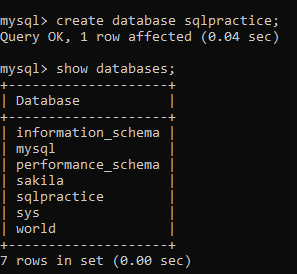

> Creating table

```
create table student (
    rollno int primary key,
    name varchar(255),
    age int
);
```

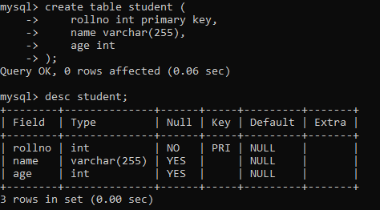

> Inserting values into table

```
insert into student values
(1, 'Kevin', 20),
(2, 'Nikhil Philip', 20),
(3, 'Tinu', 20),
(4, 'Sreeram', 20),
(5, 'Merlin', 20),
(6, 'Nikhil Abraham', 20);
```

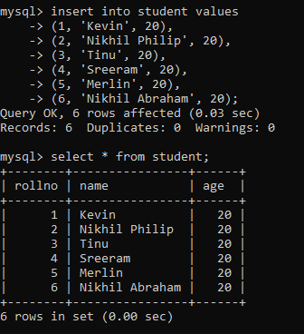

> Adding an extra column after table is already created.

```
alter table student add ph_no int;
```

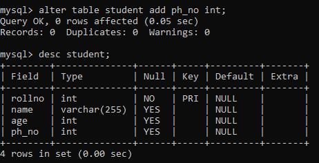

```
alter table student add dob date;
```

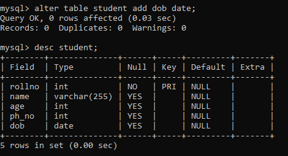

> Changing the column name heading from one to another

```
alter table student change ph_no phone_no int;
```

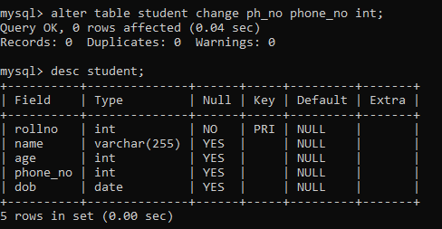

> Modifying datatypes of an existing attribute

```
alter table student modify name varchar(100);
```

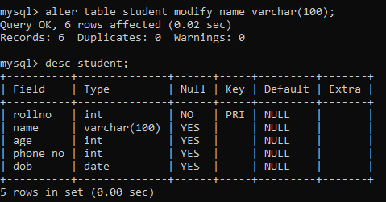

> Inserting values into an existing tuple

```
update student set dob='2002-12-13' where rollno=4;
```

The above action is restricted to tuples of the condition provided.

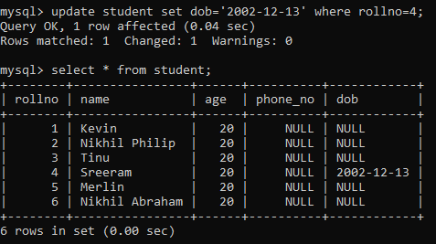

```
update student set phone_no=5678;
```

The above action updates every values in the selected attribute of the table.

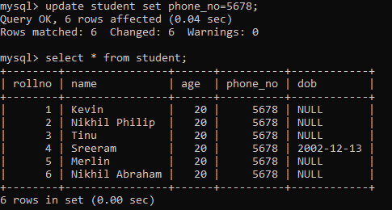

> Inserting date and time column and values to the same

```
alter table student add time time;
```

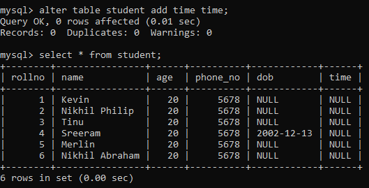

```
alter table student add date_and_time timestamp;
```

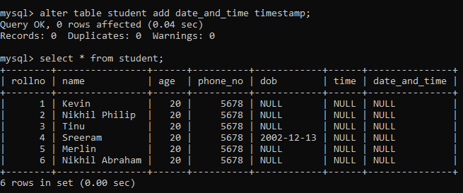

```
update student set date_and_time='2023-10-11 04:55:23' where rollno=5;
```

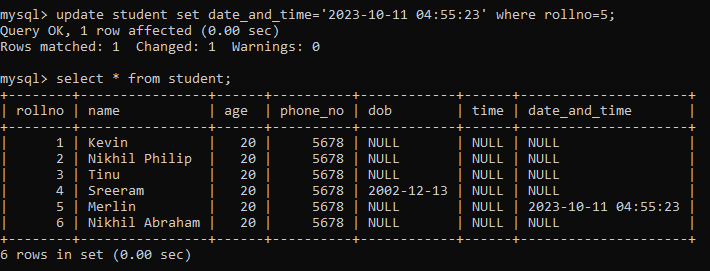

```
update student set time='05:30:13' where rollno=4;
```

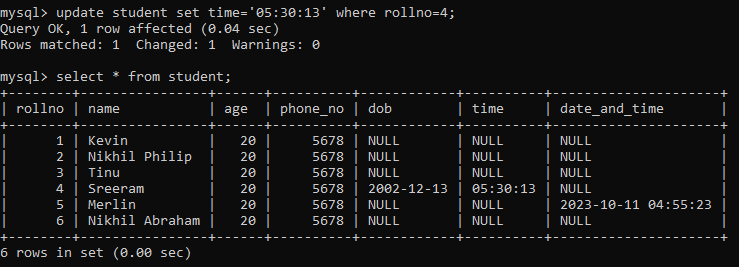

> Displaying table in various ways

```
select * from student;
```

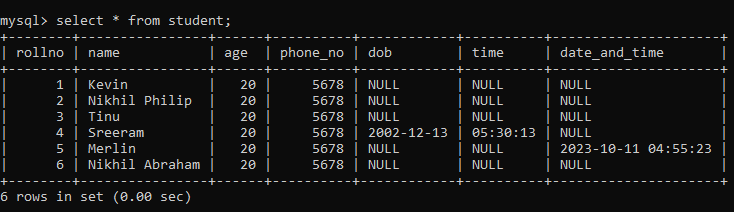

```
select rollno, name from student where rollno>2;
```

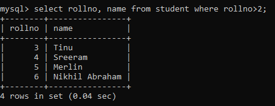

```
delete from student where rollno=4;
```

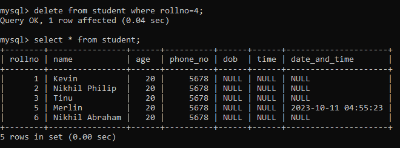
