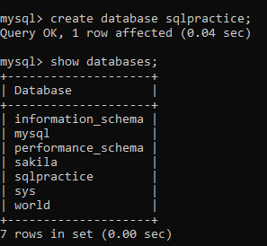
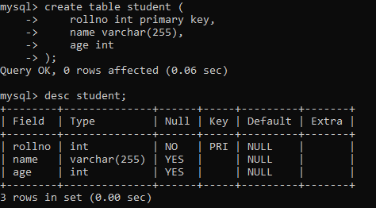
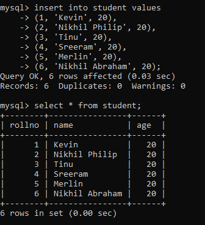

# DBMS Lab 2023

### Lab Experiments

| Experiment                                                                                                      | Date          |
| --------------------------------------------------------------------------------------------------------------- | ------------- |
| 1. [ Introduction to ER diagram and SQL](#prgm01)                                                               | Not yet done. |
| 2. [ Creation, modification, configuration and deletion command. ](#prgm02)                                     | 17-08-2023    |
| 3. [ Exprot ER diagram from database and verify relationships. ](#prgm03)                                       | Not yet done. |
| 4. [ Database Initialisation, Data Insert, Import to database. ](#prgm04)                                       | Not yet done. |
| 5. [ Practise SQL commands for DML. ](#prgm05)                                                                  | 17-08-2023    |
| 6. [ Implementation of built in functions. ](#prgm06)                                                           | Not yet done. |
| 7. [ Implementation of aggregate functions. ](#prgm07)                                                          | Not yet done. |
| 8. [ Implementation of orderby, group by, and having. ](#prgm08)                                                | Not yet done. |
| 9. [ Implementation of Set Operations, nested and queries. ](#prgm09)                                           | Not yet done. |
| 10. [ Practise of SQL TCL commands Rollback, commit, savepoint. ](#prgm10)                                      | Not yet done. |
| 11. [ Implementation of DCL commands for granting and revoking user privileges. ](#prgm11)                      | Not yet done. |
| 12. [ Practise of SQL Commands for creation or view assertion. ](#prgm12)                                       | Not yet done. |
| 13. [ Implementation of various control structures like, if then, then else, if then else, if while. ](#prgm13) | Not yet done. |
| 14. [ Creation of procedure,triggers, functions. ](#prgm14)                                                     | Not yet done. |
| 15. [ Creation of cursor. ](#prgm15)                                                                            | Not yet done. |
| 16. [ Creation of Packages. ](#prgm16)                                                                          | Not yet done. |
| 17. [ Creation of PL/SQL block for exception handling. ](#prgm17)                                               | Not yet done. |
| 18. [ Student database Management System. ](#prgm18)                                                            | Not yet done. |

## Some Basics before you start SQL

Get mySQL for your system at following Links:

##### [ Windows ](https://dev.mysql.com/downloads/windows/installer/) (This is an all-in-one package, so just download and install. It should be around 331 MB in size.)

<a name="prgm01"></a>

## 01. Introduction to ER diagram and SQL

a. [ Introduction to ER Model University Management System. ](#prgm01a)

b. [ Introduction to ER Diagram. ](#prgm01b)

c. [ Introduction to SQL. ](#prgm01c)

<a name="prgm02"></a>

## 02. Creation, modification, configuration and deletion command.

### Create Database

```
create database database_name;
```

### Create Table

```
create table table_name (
    column_name datatype(size) constraints,
    ...
);
```

### Modification

```
alter table table_name modify column_name datatype(size);
```

_Note:_ **_If you are getting error, use the following command as an alternative:_**

```
alter table table_name change old_column_name new_column_name datatype(size);
```

### Clear all values

```
Truncate table table_name;
```

or

```
delete from table_name;
```

### Delete both Schema and dates

```
drop table table_name;
```

## 05. Practise SQL commands for DML.

> Creating database

```
create database sqlpractice;
```



> Creating table

```
create table student (
    rollno int primary key,
    name varchar(255),
    age int
);
```



> Inserting values into table

```
insert into student values
(1, 'Kevin', 20),
(2, 'Nikhil Philip', 20),
(3, 'Tinu', 20),
(4, 'Sreeram', 20),
(5, 'Merlin', 20),
(6, 'Nikhil Abraham', 20);
```



> Adding an extra column after table is already created.

```
alter table student add ph_no int;
```


```
alter table student add dob date;
```


> Changing the column name heading from one to another

```
alter table student change ph_no phone_no int;
```


> Modifying datatypes of an existing attribute

```
alter table student modify name varchar(100);
```


> Inserting values into an existing tuple

```
update student set dob='2002-12-13' where rollno=4;
```

The above action is restricted to tuples of the condition provided.


```
update student set phone_no=5678;
```

The above action updates every values in the selected attribute of the table.


> Inserting date and time column and values to the same

```
alter table student add time time;
```


```
alter table student add date_and_time timestamp;
```


```
update student set date_and_time='2023-10-11 04:55:23' where rollno=5;
```


```
update student set time='05:30:13' where rollno=4;
```


<a name="prgm05"></a>

> Displaying table in various ways

```
select * from student;
```


```
select rollno, name from student where rollno>2;
```


```
delete from student where rollno=4;
```


